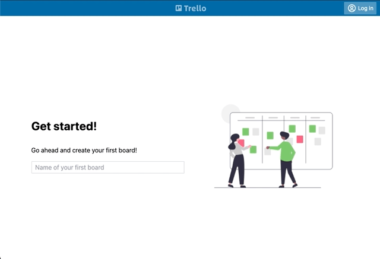

## Aplicação do Trello

<p align="center" width="100%">
    
</p>

Esta é uma versão experimental da aplicação Trello.

Para executar, basta clonar o repositório e executar

```shell
    npm install # intalação das dependências do projeto
    npm start # execução da rotina de subida da aplicação

```
